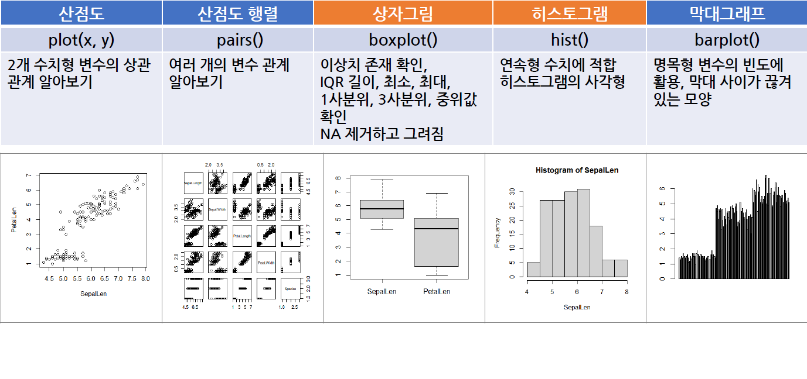
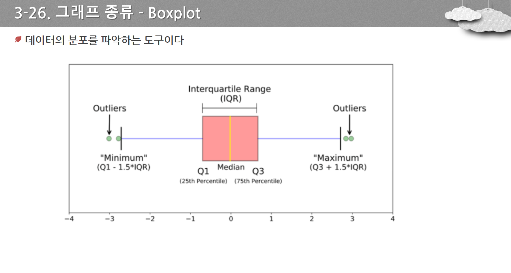
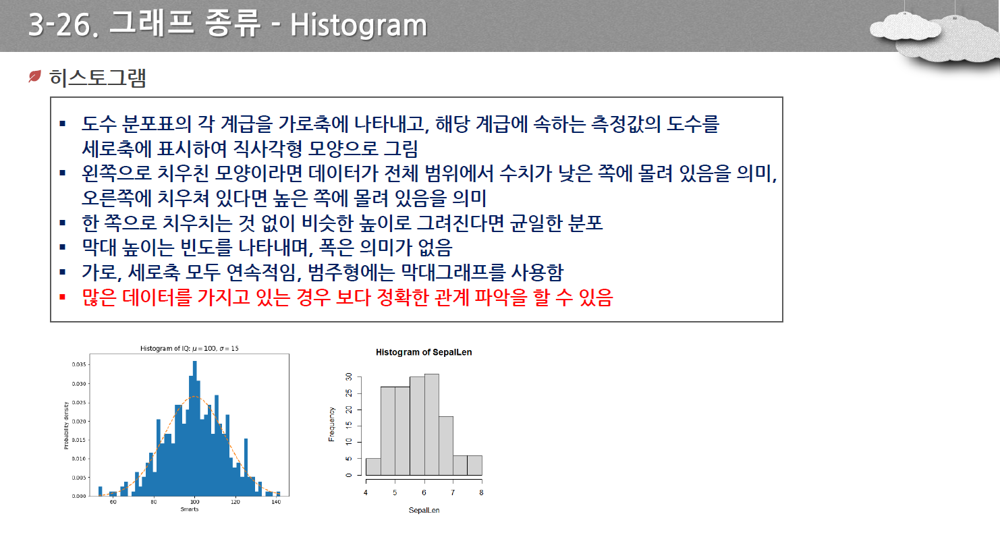

# R프로그래밍

## R프로그래밍

### R의 Type : 기본형,구조형,복잡형으로 나눌 수 있으며,Special Values가 존재
- 기본형

|데이터 형|특징|
|---|---|
|Numeric|정수,실수,복소수,수학적 연산 및 통계적 계산|
|Character|문자,단어로 구성, "" 또는 ''내에 표현|
|Logical|True,False,산술 연산시 1,0으로 사용|

- 구조형
- 복합형

|데이터 형|차원|원소|원소의 타입|
|---|---|---|---|
|scalar|단일|수치/문자/논리|단일|
|factor|1D|수치/문자|단일,범주형|
|Vector|1D|수치/문자/논리|단일|
|matrix|1D|수치/문자/논리|단일|
|data.frame|2D|수치/문자/논리|복합가능|
|array|2D이상|수치/문자/논리|단일|
|list|2D이상|수치/문자/논리|복합가능|

- Speical Values : NULL(변수 값이 초기화되지 않음), NA(Not Available,데이터 값 없음),NaN(계산 불가능),INF(Infinite,무한대)

### R의 데이터 구조-Vector
- 하나 이상의 스칼라 원소들을 갖는 단순한 형태의 집합
- 숫자,문자,논리형 데이터를 원소로 사용가능
- 동일한 자료형을 갖는 값

```c
10 + 20
5 - 2
4 * 5 
10 / 3
10%/% 3 # 몫
10 %% 3 # 나머지
2 ** 10
2 ^ 10
sqrt(16) # 제곱근
10 > 5
5 < 10
!(5==5)
```

### R의 데이터 구조-Matrix
- 데이터의 형태가 2차원으로 행과 열로 구성
- 하나의 데이터 유형만 가능 
- matrix(data=NA,nrow=1,ncol=1,byrow=FALSE(TRUE 행방향),dimnames=NULL(차원의이름))
- rbind(vector or matrix), cbind(vectors or matrix)

```c
m <- matrix(seq(1,12),nrow=4,ncol = 3)
m1 <- m[2,3]
m2 <- m[3,]
m3 <- m[,-2] # 2열 제외하고 출력
m4 <- m[c(2,3),2] # 2,3 행 2열
m5 <- m[c(TRUE,FALSE,FALSE,TRUE),] # 1,4행 모든열

a1 = array(1:12,dim=c(3,2,2))
a2 = array(1:6, dim=c(2,3))
```

### R의 데이터 구조-Data.frame
- 엑셀의 Worksheet 같은 구조
- 여러 가지 데이터 유형을 가질수 있음.

```c 
name <- c('tom','jerry','cindy','mark')
gender <- c('f','m','f','m')
kor <- c(90,100,80,95)
eng <- c(90,95,100,80)
df <- data.frame(name,gender,kor,eng)
df2 <- data.frame(matrix(seq(1,9),nrow=3))
df3 <- data.frame(gender=c('f','m','f','m'),
                  score=c(90,100,80,95),
                  stringsAsFactors = TRUE) #str Type 을 Factor로 변함

> str(df3)
'data.frame':	4 obs. of  2 variables:
 $ gender: Factor w/ 2 levels "f","m": 1 2 1 2
 $ score : num  90 100 80 95\


rm(list=ls())
name <- c('tom','jerry','cindy','mark')
gender <- c('f','m','f','m')
kor <- c(90,100,80,95)
eng <- c(90,95,100,80)
df <- data.frame(name,gender,kor,eng)

v1 <- df[1,3]
df1 <- df[2,]
v2 <- df[,'name']
v3 <- df$name # name열
df2 <- df[1] # 1번열
df3 <- df['name']
v4 <- df[[1]] # 1번열,Vector
df4 <- df[seq(1,3),c(1,2)] # 1~3번행,1,2열
df5 <- df[,2:4]
df6 <- df[1:3]
df7 <- df[-2] # 2열 삭제
df8 <- df[-c(1,2,3)]
```

### R의 데이터 구조-list
- 서로다른 데이터 타입 저장가능
- 리스트에 저장된 데이터를 index또는 key를 사용해 접근가능

### 저장,불러오기
- setwd('디렉토리 이름') / getwd() 현재 디렉터리 이름 반환
- read.csv('파일이름', fileEncoding='UTF-8-BOM')
- write.csv('파일이름', row.names=FALSE)

```c
df = read.csv('.\\data\\easySample.csv',fileEncoding = 'UTF-8-BOM')
write.csv(df,'data/mySample.csv', row.names=FALSE)
write.csv(df,'data/mySample.csv', row.names=TRUE) # 행번호추가

cname <- c('ID','name','birth','dept','english','japaneese','chineese')
df3 <- read.table('data/easySample.txt',sep=',',col.names = cname) # TEXT 불러오기

rm(list=ls())
df4 <- read.csv('data/mySample.csv')
save(df4,file='data/myObject1.Rdata') # 객체 저장
load('data/myObject1.Rdata')
```

### data.frame 핸들링
- 

```c
rm(list=ls())
df = read.csv('.\\data\\easySample3.csv',fileEncoding = 'UTF-8-BOM')
df1 <- df[,c(2,4,8,9)]
df1$score <- c(90,80,50,70,100,95,85,70,95,75)
df2 <- subset(df1,subset = (salary>=5000)) # Salary >= 5000이상
df3 <- subset(df2,select=-score) # Score 열 제외
df4 <- subset(df1,subset = (salary>=5000),select=-score)
df5 <- subset(df2,select = c(pname,dept,salary)
colnames(df5)[2] <- 'department'  #칼럼명 변경
```

### R의 데이터셋 사용
- head,tail,summary,str : vector,matrix 등의 다양한 객체 사용가능
- View : matrix,data.frame,list 등 Data 구조에 적용 가능

```c
View(iris)
head(iris,3) # 처음부터
tail(iris,3) # 끝에서 
summary(iris) # 최소,최대,평균,1사/3사분지수
str(iris) # 데이터 Type
print(iris$Sepal.Width)
attach(iris)
print(Sepal.Width)
detach(iris)
print(iris$Sepal.Width)
```

### 그래프 종류
- 그래프의 종류

- 산점도 : 2개 변수의 상관관계 plot(x,y)
- 산점도 행렬 : 여러 개의 변수 관계 pairs()
- **상자그림** : 이상치 존재 확인 NA 제외,**IQR** 길이(3사분위-1사분위), 중위값, 최소, 최대 확인. boxplot()

- 히스토그램 : 연속적 수치에 적합 hist()

- 막대 그래프 : 변수의 빈도 활용, 막대 사이가 끊겨 있는 모양 barplot()